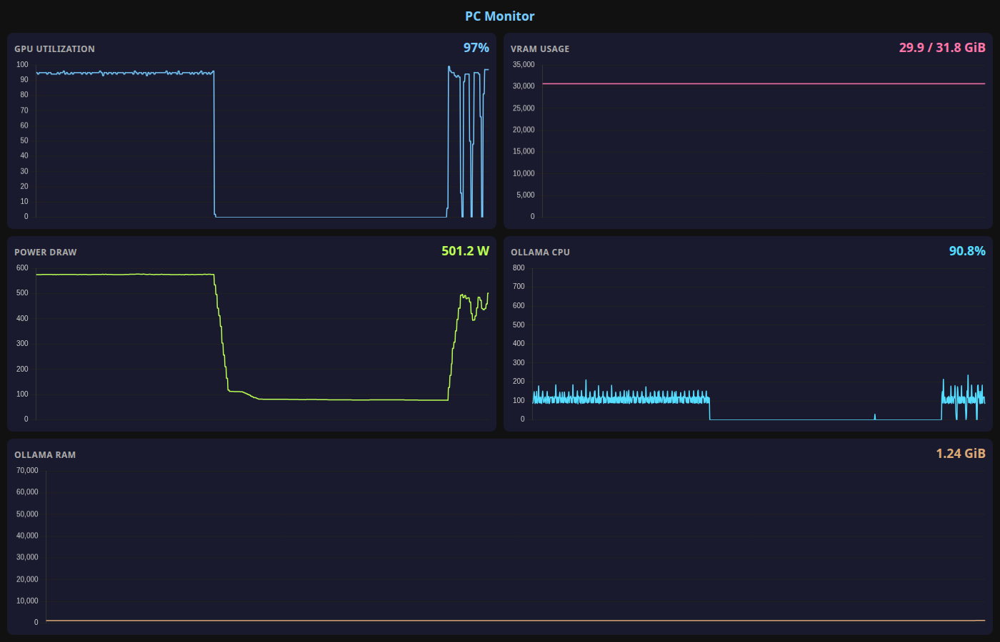

# Ollama PC Monitor



Real-time GPU and Ollama process monitoring dashboard served over WebSocket at 30 Hz.

## What it monitors

- **GPU Utilization** — percentage, from `nvidia-smi`
- **VRAM Usage** — used / total in GiB
- **Power Draw** — watts
- **Ollama CPU** — instantaneous sum across all Ollama threads (computed from `/proc/[pid]/stat` tick deltas, not lifetime-averaged `ps` output)
- **Ollama RAM** — aggregate RSS in GiB

## Architecture

A single global collector runs at 30 Hz from server start, regardless of connected clients. Snapshots are stored in a 900-sample ring buffer (30 seconds). On WebSocket connect, the full history is sent as a JSON array so charts fill instantly, then live snapshots stream individually. Multiple clients share the same data — no per-client collection overhead.

## Build and run

```bash
cargo build --release
./target/release/pc-monitor
```

Open http://localhost:8765 (binds to `127.0.0.1` only).

## Requirements

- NVIDIA GPU with `nvidia-smi` on `PATH`
- Rust 1.80+
